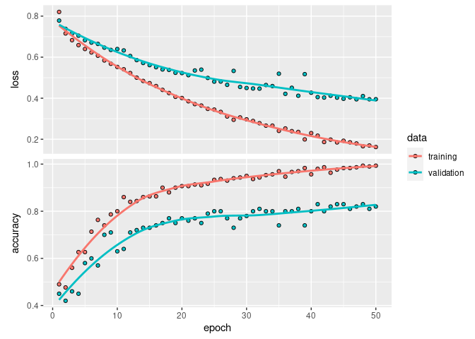

## Load the libraries

    library(keras)
    library(tensorflow)

## Define where the image datasets are

There is a small dataset of 410 images. Because there are so few images,
I will just work with a training and validation set, and I will not use
a separate test dataset.

<table>
<thead>
<tr class="header">
<th>dataset</th>
<th>benzene ring images</th>
<th>non benzene ring images</th>
</tr>
</thead>
<tbody>
<tr class="odd">
<td>train</td>
<td>150</td>
<td>150</td>
</tr>
<tr class="even">
<td>validation</td>
<td>55</td>
<td>55</td>
</tr>
</tbody>
</table>

    train_dir <- "data/train"
    validation_dir <- "data/validation"

## Create the image generators

Use data augmentation on the training set, but not the validation set.

Create a function to create the generators. This function will be called
twice. The first time will be during training of the first network. The
second time will be training the second network.

    create_generators <- function(test_validation_batch_size) {
      validation_datagen <- image_data_generator(rescale = 1/255)

      # train_datagen <- image_data_generator(
      #   rescale = 1/255,
      #   rotation_range = 90,
      #   width_shift_range = 0.01,
      #   height_shift_range = 0.01,
      #   shear_range = 0.2,
      #   zoom_range = 0.01,
      #   horizontal_flip = TRUE
      # )
      
      train_datagen <- image_data_generator(rescale = 1/255)
      
      train_generator <- flow_images_from_directory(
        train_dir,
        train_datagen,
        target_size = c(256, 256),
        batch_size = test_validation_batch_size,
        shuffle = FALSE,
        class_mode = "binary"
      )
      
      validation_generator <- flow_images_from_directory(
        validation_dir,
        validation_datagen,
        target_size = c(256, 256),
        batch_size = test_validation_batch_size,
        shuffle = FALSE,
        class_mode = "binary"
      )
      
      list(train_generator = train_generator, validation_generator = validation_generator)
    }

## Define the network

Use VGG16 trained on imagenet for the convolutional layers. Freeze the
convolutional layers so that their weights are not adjusted during
training. The final layers will be a simple binary classifier made with
dense layers.

First, make a function that can return an initalized network.

    create_network <- function() {
      conv_base <- application_vgg16(
        weights = "imagenet",
        include_top = FALSE,
        input_shape = c(256, 256, 3)
      )
      
      conv_base %>% freeze_weights()
      
      network <- keras_model_sequential() %>%
        conv_base %>%
        layer_flatten() %>%
        layer_dense(units = 256, activation = "relu") %>%
        layer_dense(units = 128, activation = "relu") %>%
        layer_dense(units = 64, activation = "relu") %>%
        layer_dense(units = 1, activation = "sigmoid")
      
      network %>% compile(
        loss = "binary_crossentropy",
        optimizer = optimizer_rmsprop(learning_rate = 0.5e-5),
        metrics = c("accuracy")
      )
      
      network
    }

Now use the function to create the network

    convnet_1 <- create_network()

    ## Loaded Tensorflow version 2.7.0

    summary(convnet_1)

    ## Model: "sequential"
    ## ________________________________________________________________________________
    ##  Layer (type)                       Output Shape                    Param #     
    ## ================================================================================
    ##  vgg16 (Functional)                 (None, 8, 8, 512)               14714688    
    ##                                                                                 
    ##  flatten (Flatten)                  (None, 32768)                   0           
    ##                                                                                 
    ##  dense_3 (Dense)                    (None, 256)                     8388864     
    ##                                                                                 
    ##  dense_2 (Dense)                    (None, 128)                     32896       
    ##                                                                                 
    ##  dense_1 (Dense)                    (None, 64)                      8256        
    ##                                                                                 
    ##  dense (Dense)                      (None, 1)                       65          
    ##                                                                                 
    ## ================================================================================
    ## Total params: 23,144,769
    ## Trainable params: 8,430,081
    ## Non-trainable params: 14,714,688
    ## ________________________________________________________________________________

## Fit the network using the training and validation data

Checkpoint every model that shows a better `val_accuracy` than the
previous. Stop training when there have been 5 epochs without
improvement to `val_accuracy`.

    tensorflow::set_random_seed(0)

    callbacks_list <- list(
      callback_model_checkpoint(
        filepath = "convnet_1_checkpoint.h5",
        monitor = "val_accuracy",
        mode = "max",
        save_best_only = TRUE
      )
    )

    test_validation_batch_size <- 25
    generators_1 <- create_generators(test_validation_batch_size = test_validation_batch_size)

    fit_history_1 <- convnet_1 %>%
      fit(
        generators_1$train_generator,
        steps_per_epoch = 300/test_validation_batch_size,
        epochs = 50,
        validation_data = generators_1$validation_generator,
        validation_steps = 110/test_validation_batch_size,
        callbacks = callbacks_list
      )

## Analyze training history

    plot(fit_history_1)

    ## `geom_smooth()` using formula 'y ~ x'

What epoch had the maximum validation accuracy?

    max_val_accuracy_1 <- max(fit_history_1$metrics$val_accuracy)
    argmax_val_accuracy_1 <- which.max(fit_history_1$metrics$val_accuracy)
    cat("Maximum val_accuracy: ", max_val_accuracy_1, "\n")

    ## Maximum val_accuracy:  0.83

    cat("Epoch of maximum validation accuracy: ", argmax_val_accuracy_1, "\n")

    ## Epoch of maximum validation accuracy:  41

## Reload the best model that was saved

    reload_convnet_1 <- load_model_hdf5("convnet_1_checkpoint.h5")
    reload_convnet_1 %>% evaluate(generators_1$validation_generator)

    ##      loss  accuracy 
    ## 0.3995895 0.8363636
